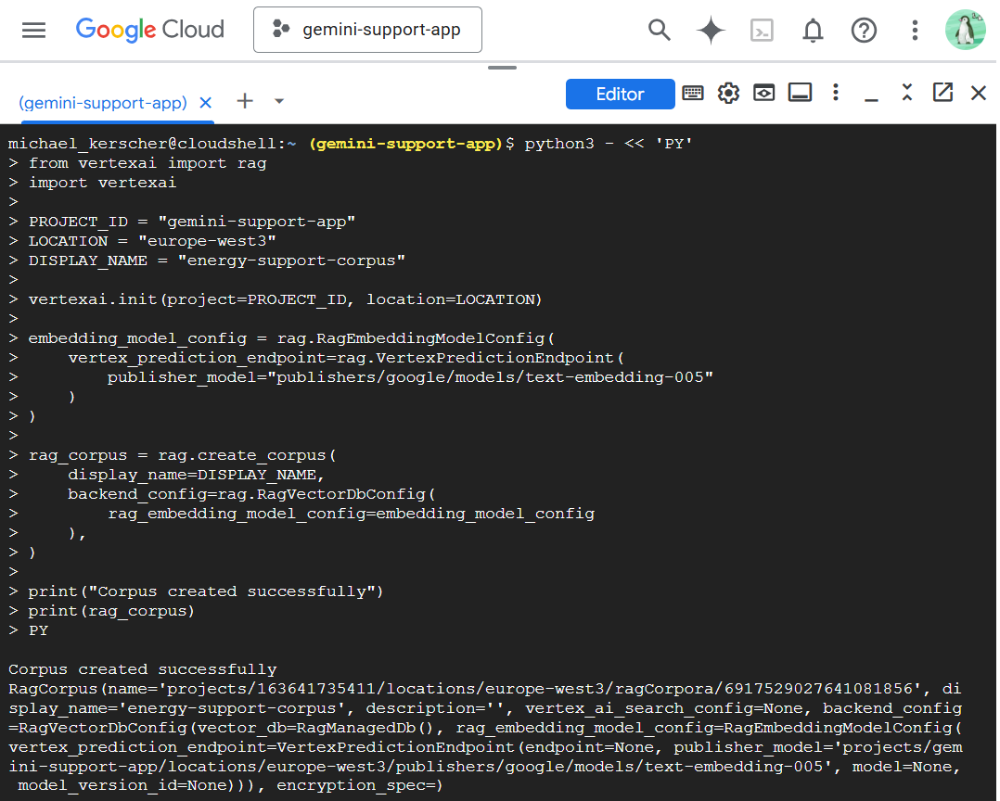
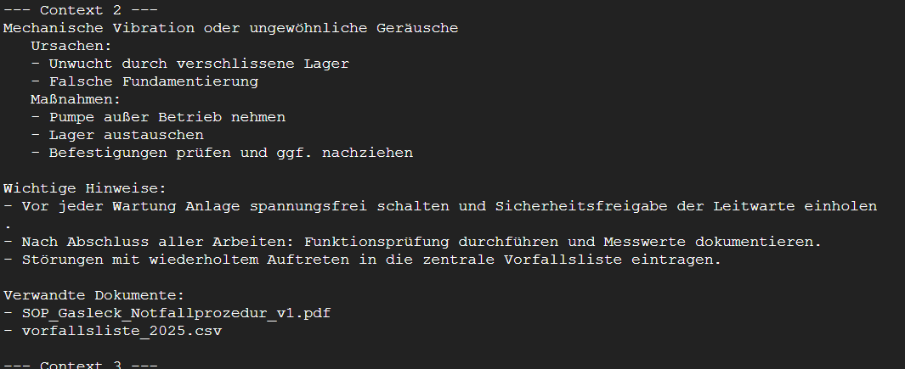

## Phase 2 - Knowledge Integration Prototype
**Project:**  `gemini-support-app`  
**Region:** `europe-west3` (Frankfurt)  
**Date:** October 2025  
**Objective:** Enable Retrieval-Augmented Generation (RAG) on Google Cloud to ground Gemini responses in enterprise knowledge.

---

### Step 1 - Vertex AI Environment Setup

**Actions performed**
- Verified active project (`gcloud config set project gemini-support-app`)
- Verified authentication (Cloud Shell uses default service account automatically)
- Installed SDK components for Vertex AI and Generative AI
- Imported and validated installed versions in Python

**Outcome**  
Vertex AI SDK successfully installed and initialized.   
Cloud Shell environment authenticated and ready for RAG Engine calls.  

---

### Step 2 - Create RAG Corpus

**Objective**  
Provision a managed vector database (`RagManagedDB`) and define the embedding model used for text similarity and retrieval.  

**Python code executed**  

```python
from vertexai import rag
import vertexai

PROJECT_ID = "gemini-support-app"
LOCATION = "europe-west3"
DISPLAY_NAME = "energy-support-corpus"

vertexai.init(project=PROJECT_ID, location=LOCATION)

embedding_model_config = rag.RagEmbeddingModelConfig(
    vertex_prediction_endpoint=rag.VertexPredictionEndpoint(
        publisher_model="publishers/google/models/text-embedding-005"
    )
)

rag_corpus = rag.create_corpus(
    display_name=DISPLAY_NAME,
    backend_config=rag.RagVectorDbConfig(
        rag_embedding_model_config=embedding_model_config
    ),
)

print(rag_corpus)
```

**Cloud Shell:**  


**Result**  
- RAG corpus created successfully: `projects/163641735411/locations/europe-west3/ragCorpora/6917529027641081856`
- Embedding model: `text-embedding-005`
- Vector database backend: `RagManagedDb (Spanner)`

**Outcome**  
Corpus `energy-support-corpus` successfully initialized for enterprise knowledge integration.

---

### Step 3 - Import Documents from Cloud Storage

**Objective**  
Populate the RAG corpus with simulated enterprise documents in Cloud Storage.  

**Comment:**  
All documents were already uploaded to the bucket `gs://gemini-support-knowledge/documents/` in Phase 1.  

**Python code executed**  
```python
response = rag.import_files(
    corpus_name="projects/gemini-support-app/locations/europe-west-3/ragCorpora/6917529027641081856",
    paths=["gs://gemini-support-knowledge/documents/"],
    transformation_config=rag.TransformationConfig(
        rag.ChunkingConfig(chunk_size=512, chunk_overlap=100)
    ),
    max_embedding_requests_per_min=9000,
)

print(f"Imported {response.imported_rag_files_count} files.")
```

**Cloud Shell:**  


**Result**  
- Imported: 3 files
- Skipped (duplicates): 0

**Outcome**  
Documents successfully embedded, chunked and indexed within the RAG corpus.  

---

### Step 4 - Test Retrieval from RAG Corpus

**Objective**  
Verify that semantic retrieval returns relevant enterprise contexts.  

**Python code executed**  
```python
query_text = "Wie wird bei einem Gasleck laut Notfallprozedur reagiert?"

response = rag.retrieval_query(
    rag_resources=[rag.RagResource(rag_corpus=CORPUS_NAME)],
    text=query_text,
    rag_retrieval_config=rag.RagRetrievalConfig(top_k=3)
)

for i, ctx in enumerate(response.contexts.contexts):
    print(f"--- context {i+1} ---")
    print(ctx.text[:800])
```

**Cloud Shell:**  





**Observed Output**  
- Context 1: SOP_Gasleck_Notfallprozedur_v1.txt
  - Describe evacuation, gas shut-off and notification steps
- Context 2: Maintenance checklist referencing SOP and incident list
- Context 3: Technical manual excerpt (less relevant but contextually linked)

**Outcome**  
Semantic retrieval confirmed operational: German documents correctly indexed and retrievable by context.

---

### Step 5 - Context-Grounded Generation with Gemini 2.5 Flash

**Objective**  
Use the Gemini 2.5 Flash model to generate a factually grounded response using the retrieved context.  

**Python code executed**  
```python
from vertexai.generative_models import GenerativeModel, Tool

rag_retrieval_tool = Tool.from_retrieval(
    retrieval=rag.Retrieval(
        source=rag.VertrexRagStore(
            rag_resources=[rag.RagResource(rag_corpus=CORPUS_NAME)],
            rag_retrieval_config=rag.RagRetrievalConfig(top_k=3),
        ),
    )
)

rag_model = GenerativeModel(
    model_name="gemini-2.5-flash",
    tools=[rag_retrieval_tool]
)

query = "Wie soll laut Notfallprozedur bei einem Gasleck vorgegangen werden?"
response = rag_model.generate_content(query)
print(response.text)
```

**Cloud Shell:**  


**Generated Answer (excerpt)**
1. "Arbeiten sofort einstellen und alle Personen aus dem Gefahrenbereich entfernen"
2. "Keine elektrischen Geräte oder Lichtschalter betätigen"
3. "Fenster und Türen öffnen"
4. "Hauptgashahn schließen, sofern gefahrlos möglich."
5. "Leitwarte informieren und Notruf (112) absetzen."

**Outcome**  
Gemini 2.5 Flash generated a grounded, accurate and context-sensitive German response directly based on the SOP document.  
No hallucinations observed.  

---

**Next Steps:**  
Integrate the RAG-enabled Gemini backend with the FastAPI backend, allowing the mobile support app to query the enterprise knowledge base dynamically.

